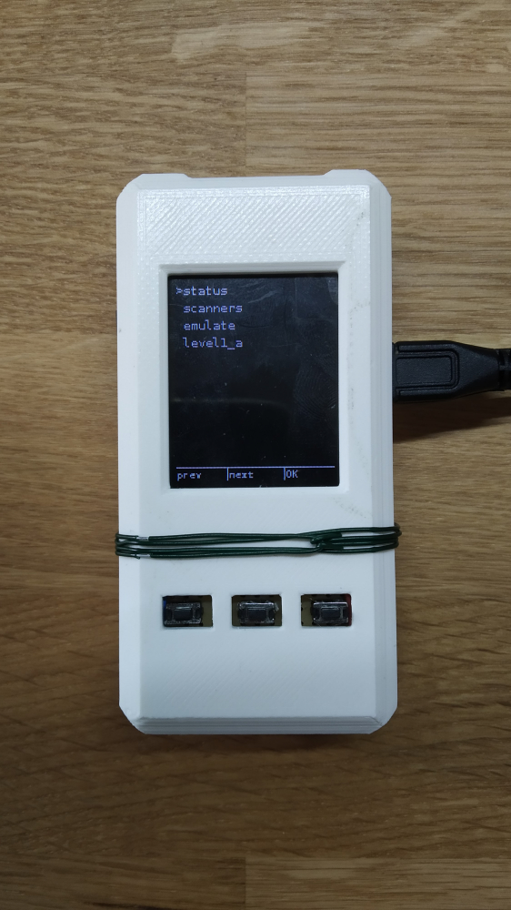

# Sidekick lite

This project is basically combining a Pi Zero W and a Pi Pico and is a proof of concecpt.

Wiring the components is straightforward. For Pi-Pico just follow the [PICO documentation](https://datasheets.raspberrypi.org/pico/getting-started-with-pico.pdf) and look for "SWD Port Wiring" + "Powering the board" sections. 

For the screen, use `spi0` and in the `ui/screen.py` you can see the gpio pins used. 

For the buttons, they are currently wired on gpio `27` `18` and `17` teach button is connected to a small `~100k` resistor that are collectively connected to `3v3` on the pi, in hindsight, they should have been connected to ground, but then you have to setup the pins in `ui/hardware.py` as `PULL_DOWN`.

